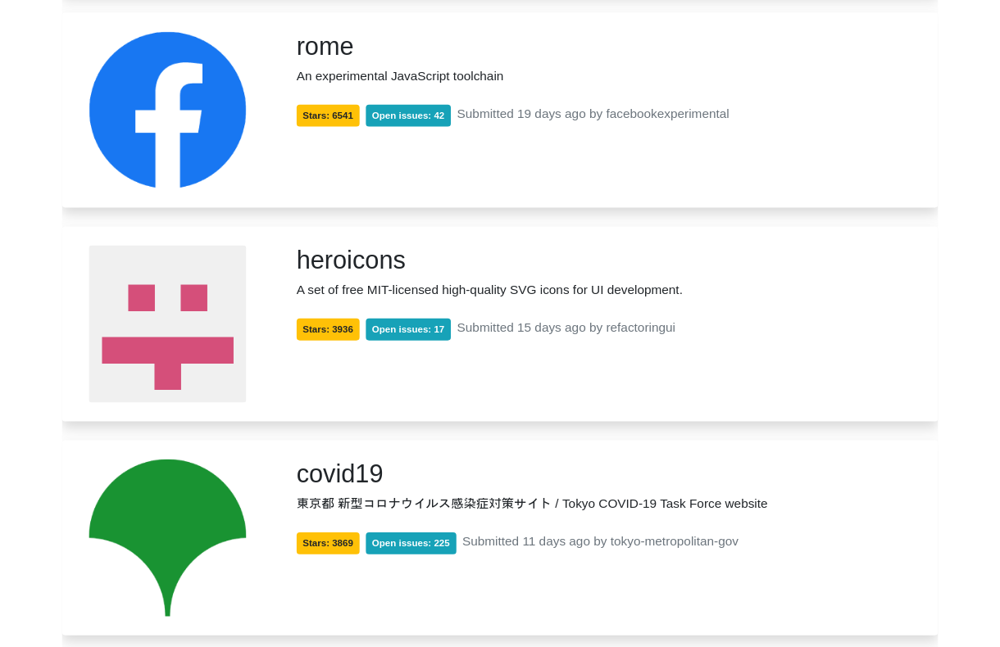

# github-starred-repos
A small webapp that lists the most starred Github repos that were created in the last 30 days.

# Features
  - React Redux
  - Redux Saga
  - Infinite Scroll
  - ESLint
  
The application has been developed using **programming best practices**. It is built in such a way that whenever there is a service call, the result will be added to the previous page's results and stored in the **Redux store**.

# How to run the App ?

In the project directory, you can run:

### `npm install` 

To install the needed dependencies, then you can run:

### `npm start`

to run the app in the development mode. 
Open [http://localhost:3000](http://localhost:3000) to view it in the browser.

The page will reload if you make edits. 
You will also see any lint errors in the console.

# Screenshot

